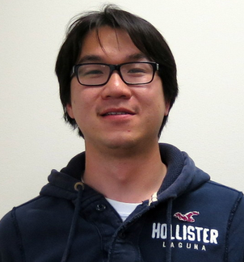

<h1 class="page-title">Professor Simon S. Woo</h1>

<!--  -->

    

        

            

                
            

            

                <h5 style="color: #1976d2; margin-top: 0; margin-bottom: 20px; border-bottom: 2px solid #1976d2; padding-bottom: 10px;">Education & Career Highlights</h5>
                

                    • <strong>SKKU Fellowship Professor</strong>, 2022 (<a href="https://cs.skku.edu/ko/edures/education/view/7054">News</a>) 
                    • <strong>Early Tenure Granted</strong>, 2024 
                    • <strong>Ph.D.</strong> Computer Science, University of Southern California (USC), Los Angeles, CA 
                    • <strong>M.S.</strong> Computer Science, University of Southern California (USC), Los Angeles, CA 
                    • <strong>M.S.</strong> Electrical and Computer Engineering, University of California, San Diego (UCSD), CA 
                    • <strong>B.S.</strong> Electrical Engineering, University of Washington (UW), Seattle, WA 
                    

                        <em>Fluent in Korean and English</em>
                    

                

            

        

    

    

        <h5 style="color: #1976d2; margin-top: 0;">Research Philosophy</h5>

        
<strong>Breaking Boundaries.</strong> My mission is to guide students beyond their comfort zones, fostering intellectual growth that transcends technical expertise. I encourage them to embrace diverse perspectives and challenge conventional thinking, cultivating both professional excellence and personal development.

        
<strong>Global Excellence.</strong> Our vision extends far beyond institutional or national recognition. I am committed to developing globally competitive scholars who contribute meaningfully to the international research community, establishing themselves as leaders in their fields.

        
<strong>Diversity as Strength.</strong> Having experienced two decades as an immigrant and minority scholar, I have witnessed firsthand the transformative power of diversity and mutual respect. I am dedicated to creating synergistic collaborations between Korean and international students, where different backgrounds and perspectives become catalysts for innovation and growth.

    

    

        <h5 style="color: #1976d2; margin-top: 0; margin-bottom: 20px; border-bottom: 2px solid #1976d2; padding-bottom: 10px;">Work Experience</h5>
        

            

                <strong style="color: #1976d2;">• Tenured Associate Professor</strong>, Sungkyunkwan University (SKKU), 2019-Present 
                

                    ➤ Applied Data Science (데이터사이언스) 
                    ➤ <a href="https://swb.skku.edu/security2020/index.do" target="_blank">CSE (소프트웨어/융합보안대학원)</a> 
                    ➤ <a href="https://skb.skku.edu/skkuaai/index.do" target="_blank">Applied AI Dept. (인공지능융합학과)</a> 
                    ➤ <a href="https://ai.skku.edu" target="_blank">AI (인공지능학과)</a> 
                    ➤ <a href="https://intelligentsw.skku.edu/intelligentsw/index.do" target="_blank">지능형소프트웨어학과</a>
                

            

            • <strong>Research Assistant Professor</strong>, Stony Brook University (SBU), Stonybrook, NY, 2017-2019 
            • <strong>Assistant Professor</strong>, The State University of New York (SUNY), Korea, 2017-2019 
            • <strong>Member of Technical Staff</strong>, NASA Jet Propulsion Lab (JPL), Pasadena, CA, 2005-2014 
            • <strong>Researcher</strong>, Verisign Research Lab, Reston, VA, 2016 
            • <strong>Co-op Intern</strong>, Intel Corp, 2001, 2002 
            

                <em>Part-time cook at Burger King, Waiter & Dishwasher, once upon a time in highschool/college years</em>
            

        

    

    

        <h5 style="color: #1976d2; margin-top: 0; margin-bottom: 20px; border-bottom: 2px solid #1976d2; padding-bottom: 10px;">Research Interests</h5>
        

            • <strong>Generative AI Model</strong> 
            

                Media Coverage: <a href="https://www.joongang.co.kr/article/25140582#home" target="_blank">중앙일보</a>, <a href="https://sports.khan.co.kr/entertainment/sk_index.html?art_id=202306220218003&sec_id=540201&pt=nv" target="_blank">경향신문</a>, <a href="https://www.arirang.com/tv/37/archive?board=147&id=28137&sort=episode" target="_blank">아리랑TV</a>
            

            • <strong>AI Security</strong> 
            • <strong>Deepfake Detection and Generation</strong> 
            • <strong>Time Series Analysis / Anomaly Detection</strong> 
            • <strong>Computer Security</strong> (Usable Security, Blockchain, Intrusion/Anomaly Detection) 
            • <strong>Satellite Image Processing</strong>, Object Detection, Communications and Protocols 
            • <strong>Data Science</strong> 
        

        

            
        

    

    

        <h5 style="color: #1976d2; margin-top: 0; margin-bottom: 20px; border-bottom: 2px solid #1976d2; padding-bottom: 10px;">International Honors and Awards</h5>
        

            🏆 <strong>2024</strong> - The 28th Pacific-Asia Conference on Knowledge Discovery and Data Mining (PAKDD), <a href="https://pakdd2024.org/award24awardpakdd24/">Best Paper Running-Up Award</a> (2nd Place out of 720 papers) 
            🏆 <strong>2023</strong> - The 38th ACM/SIGAPP Symposium on Applied Computing (SAC), <a href="https://www.sigapp.org/sac/sac2023/" target="_blank">Best Paper Award (AI and Agents)</a> (<a href="https://www.acm.org/conferences/best-paper-awards" target="_blank">ACM Archive</a>) 
            🎓 <strong>2023</strong> - Invited for Schloss Dagstuhl (Leibniz Center for Informatics) on 23021 Media Forensics and the Challenge of Big Data 
            🏆 <strong>2021</strong> - PLP 2021: Workshop on Programming Language Processing, <a href="https://sw.skku.edu/sw/news.do?mode=view&articleNo=150622&article.offset=10&articleLimit=10&srSearchVal=우사이먼">Best Paper Award</a>, KDD 
            🏆 <strong>2016</strong> - The 17th World Conference on Information Security Applications (WISA), Best Paper Award 
            🎓 <strong>2003</strong> - Mary Gates Scholar, University of Washington, Seattle, USA 
        

    

    

        <h5 style="color: #1976d2; margin-top: 0; margin-bottom: 20px; border-bottom: 2px solid #1976d2; padding-bottom: 10px;">Professional Services</h5>
        

            

                <strong style="color: #1976d2;">📌 Leadership Roles (2024-2025)</strong> 
                

                    • KDD Research Track Area Chair 
                    • CIKM Senior PC on Resource/Demo Track 
                    • IJCAI Web Chair 
                    • ACML Area Chair
                

            

            

                <strong style="color: #1976d2;">📌 Conference/Workshop Chairing</strong> 
                

                    • ACM CoNext Finance Chair (2017) 
                    • EAI CyDiP Technical Program Committee Chair (2021)
                

            

            

                <strong style="color: #1976d2;">📌 Technical Program Committees</strong> 
                

                    SecureComm, SOUPS, TheWebConf (WWW), ACM SAC ML Track, ECCV, ACCV, BMVC, ICCV, CSET, CIKM, AAAI, KDD, IJCAI, WACV, ICML, CVPR, ICPR, SDM, NeurIPS (2019-2024)
                

            

            

                <strong style="color: #1976d2;">📌 Editorial Boards</strong> 
                

                    • TIIS Editor (2019-2021) 
                    • IEEE TIFS (2019) 
                    • AIAA Journal of Aerospace Information Systems (2020)
                

            

            

                <strong style="color: #1976d2;">📌 Workshop Organizer</strong> 
                

                    • ACM AsiaCCS Workshop on Deepfakes and Cheapfakes (WDC) (<a href="https://sites.google.com/view/wdc-2022/" target="_blank">2022</a>, <a href="https://sites.google.com/view/wdc-2023/" target="_blank">2023</a>, <a href="https://sites.google.com/view/wdc-2024/" target="_blank">2024</a>) 
                    • <a href="https://sites.google.com/view/ansd23?pli=1" target="_blank">ANSD Workshop</a> at CIKM 2023, Birmingham UK 
                    • AIMM 2024 at <a href="https://insights.sei.cmu.edu/news/international-conference-on-conceptual-modeling-er-2024-opens-call-for-papers/" target="_blank">ER 2024</a>, Carnegie Mellon University
                

            

        

    

